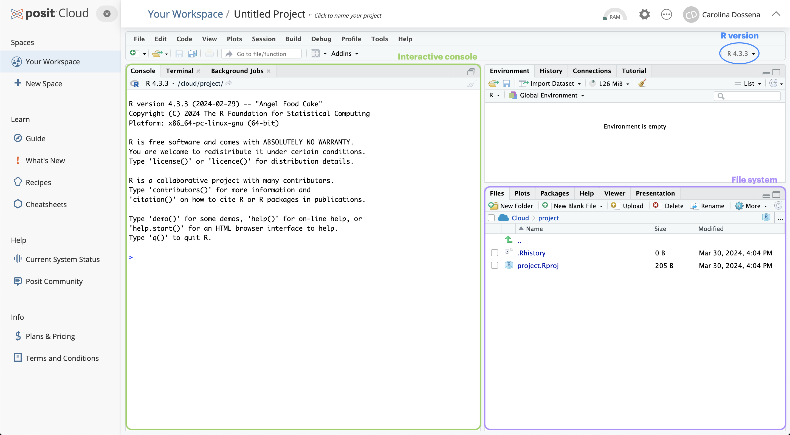
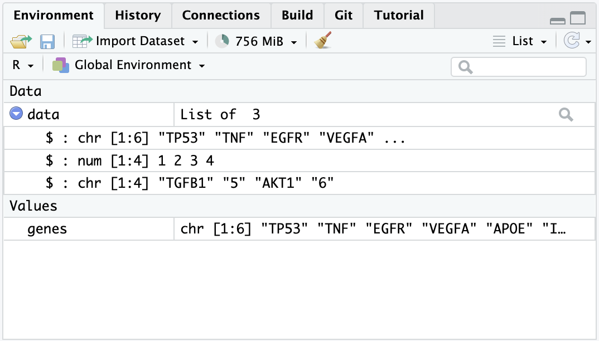

```{r setup, include=FALSE}
library(kableExtra)
knitr::opts_chunk$set(engine = 'R', echo = TRUE, fig.align = 'center', warning = FALSE, message = FALSE)
```

```{=html}
<style>
div.col pre { background-color:lightpink; }
div.col pre.r { background-color:white; }
</style>
```
# Objectives

-   Introduction to ChIP-seq
-   Setting up R environment
-   Understanding ChIP-seq (and NGS) data *core* processing
-   Dataset introduction and exploration

## The ChIP-seq technology

Chromatin immunoprecipitation (ChIP) assays are used to **analyze protein interactions with DNA**. By combining this method with Next Generation Sequencing, ChIP-sequencing (ChIP-seq) is a powerful method for identifying genome-wide the chromosomal locations of different kinds of proteins, including transcription factors, nucleosomes, chromatin remodeling enzymes and polymerases, and also histone modifications.

> ChIP-seq use in mapping histone modifications has been seminal in epigenetics research! (Ku et al., [2011](https://pubmed.ncbi.nlm.nih.gov/21825079/))

The standard ChIP-seq protocol first **cross-link bound proteins to chromatin, fragments the chromatin, captures the DNA fragments bound to one protein using an antibody specific to it, and sequences the ends of the captured fragments using NGS**. Here you can see the major steps:

```         
+ Cross-linking: add Formaldehyde
+ Hydrolysis (breakdown of cell memberane)
+ Lyses of DNA fragments (shearing), e.g. treat with specific endonuclease enzymes (dpn1)
+ Add specific antibody (with beads) against the protein of interest. This will drag the protein down by immuno-precipitation
+ Separate DNA from the protein (unlinking), and purify the DNA
+ DNA fragments are amplified and fluorescently tagged, library construction, and fragments are then sequenced
```

<center>

<div>


</div>

</center>

## Tips for designing a ChIP-seq experiment

A common goal in ChIP-seq experiments is to **identify changes in protein binding patterns** between conditions (i.e. differential binding).

Effective analysis of ChIP-seq data requires sufficient coverage by sequence reads (sequencing depth). It mainly depends on the size of the genome, and the number and size of the binding sites of the protein.

-   For mammalian transcription factors (TFs) and chromatin modifications such as enhancer-associated histone marks: **20 million reads** are adequate

-   Proteins with more binding sites (e.g., RNA Pol II) or broader factors: need more reads, up to **60 million** for mammalian ChIP-seq

-   Sequencing depth rules of thumb: \>10M reads for *narrow* peaks, \>20M for *broad* peaks

-   Long & paired-end reads useful but not essential

-   Replicates: The good news here is that, unlike RNA-Seq, more than 2 replicates does not significantly increase the number of targets

A successful ChIP-seq experiment must have its right **controls**: they are essential to eliminate false positives as there is always some signal on open chromatin. Two types of controls are often used:

-   An "**input**" DNA sample (fragmented genomic DNA), the one that has been cross-linked and sonicated but not immuno-precipitated

-   An **IgG** "mock"-ChIP, using an antibody that will not bind to nuclear proteins and should generate random immuno-precipitated DNA.

> Input DNA control is ideal in most of the cases. Indeed, one problem with IgG control is that if too little DNA is recovered after immuno-precipitation, sequencing library will be of low complexity and binding sites identified using this control could be biased. Read [this biostars post](https://www.biostars.org/p/15817/) for discussion.

## Next Generation Sequencing

NGS technologies (Illumina/PacBio) allow the processing of millions of reactions in parallel, resulting in high-throughput, higher sensitivity, speed and reduced cost compared to first generation sequencing technologies (e.g., Sanger method).

> Given the vast amounts of quantitative sequencing data generated, NGS-based methods rely on resource-intensive **data processing pipelines** to analyze data.

In addition to the sequence itself, and unlike Sanger sequencing, the high-throughput nature of NGS provides **quantitative** information (depth of coverage) due to the high level of sequence redundancy at a locus.

There are short-read and long-read NSG approaches. Short reads of NGS range in size **from 75 to 300 bp** depending on the application and sequencing chemistry. NGS is taken to mean second generation technologies, however 3G and 4G technologies have since evolved (enable longer read sequences in excess of **10 kilobases**).

Among 2G NGS chemistries, Illumina **sequencing by synthesis** (SBS) is the most widely adopted worldwide, responsible for generating more than 90% of the world's sequencing data.

<center>

<div>


</div>

## Setting up Rstudio

First of all, let's start assembling the tools that you will need for this workshop! While R by itself has no particular user interface, RStudio is the tool that allows you to click and actually 'see' what you are doing. RStudio is an *integrated development environment* (IDE) and will be our primary tool to interact with R.

You can follow two strategies:

1.  Install `R` and RStudio on your machine
2.  Run RStudio in a browser using RStudio Cloud.

Note that the first option will require a bit more time and effort. To get started with RStudio Cloud (noew Posit Cloud), click on [this link](https://posit.cloud/plans/free) and create a Posit free account. Once you completed your registration, you are redirected to `Your Workspace`. To start a new R project, you can click on `New Project > New RStudio Project`. This will open RStudio on the Cloud.

## The RStudio Interface

Now that you have RStudio open, you should see something similar to this:

<center></center>

The RStudio interface is composed of *quadrants*:

1.  The `Console` window: located in the bottom-left, it's where you will find the output of your coding, and it's also possible to type `R` code *interactively* on the console.

2.  The `Files / Plots / Packages / Help / Viewer` window: located in the bototm-right, it currently displays your **current file system** (on the Cloud), which is pointed to the position where your `Rproject` you just created lives.

    -   The *Files* pane lists the files and folders in your **root directory** (i.e. where by default RStudio save your analyses).

    -   Another important pane is *Plots*, designed to show you any plots you have created.

    -   The *Package* pane instead allows to manage all the **additional tools** you can import and use when you perform your analyses. They are useful to enhance the basic R functions from different aspects.

    -   If you need H E L P, you can use the *Help* pane: you can search for specific topics, for instance how a computation works and other kinds of documentation.

3.  The `Environment / History / Connections / Tutorial` window: you can find it in the top right.

    -   It is pointed to the *Environment* pane, that is a place where you can find all the *objects* available for computation (e.g. datasets, plots, lists, etc.).

    -   The *History* pane keeps whatever computation you run in the console. You can rerun the computation stored in the history and you can also copy the past code into an existing or new *R Script*.

## R fundamentals

### Basic computations

The most basic computation you can do in *R* is arithmetic operations. Let's take a look at the following examples:

```{r}
# Addition
14 + 7

# Division
14 / 7

# Square root
sqrt(14)
```

But R is much more than an enormous calculator! Besides arithmetic operations, there are also logical queries you can perform. Logical queries always return either the value `TRUE` or `FALSE`.

```{r}
#1 Is it TRUE or FALSE?
3 == 3

#2 Is 45 bigger than 55?
50 > 56

#3 Are these two words NOT the same?
"Gene" != "gene"
```

> Notice that in logical queries, `equal to` is represented by `==` and not by `=` , which instead is used to assign a value to an object. However, in practice, most *R* programmers tend to avoid `=` since it can easily lead to confusion with `==`.

### Assigning values to objects with `<-`

Assigning values to objects is another common task that we will perform. What can be an *object* ?

-   a list of names
-   a series of number
-   a dataset
-   a plot
-   a function
-   etc.

In short, an object can enclose different things which form part of your data analysis. For example, objects are useful to store results that you want to process further in later steps of the analysis. We have to use the assign operator `<-` to assign a value to an object. Let's have a look at an example.

```{r}
# Let's assign the gene "TP53" to the "genes" object
genes <- "TP53"
```

Now the object `genes` carries the value `"TP53"`. If you check out the *Environment* pane, you should see that the `gene` object appeared there. We can also print values of an object in the console by simply typing the name of the object `genes` and hit `Return ↵`.

```{r}
# What are my genes?
genes
```

To create objects with multiple values, we can use the function `c()` which stands for 'concatenate':

```{r}
# Adding some more genes to the object
genes <- c("TP53",
           "TNF",
           "EGFR",
           "VEGFA",
           "APOE",
           "IL6")
           
# Here are my genes
genes
```

To concatenate values into a single object, we need to use a comma `,` to separate each value. Otherwise, *R* will report an error back.

::: col
```{r error = TRUE, include=TRUE}
genes <- c("TP53" "TNF")

```
:::

Don't worry about it! R's error messages tend to be very useful and give meaningful clues to what went wrong. In this case, we can see that something 'unexpected' happened, and it shows where our mistake is.

## Object types: `list`

Values inside objects are meant to be of the same type, for instance *numeric* or *character*. Consequently, mixing different types of data into one object is likely a bad idea. However, there is an exception: a `list` object can hold other objects of different data types.

```{r}
data <- list(genes,
             c(1, 2, 3, 4),
             c("TGFB1", 5, "AKT1", 6))
data
```

You will notice in this example that I do not use `""` for each value in the list. This is because `genes` is not a `character` value, but an object. When we refer to objects, we do not need quotation marks.

Looking at the list item in the environment page, you can see that the object `data` is classified as a `List of 3,` and if you click on the blue icon, you can inspect the different objects inside.

<center>{width="500"}</center>

### Functions

We mention the term '*function*' multiple times, but what are functions and why we need them? In simple terms, functions are objects that contain lines of codes and can be seen as shortcuts for our programming. They are useful to save space and time and to make our code more readable and reliable. We will make an example to understand better, by calculating the arithmetic mean:

```{r}
# We create an object that stores our values
values <- c(1, 5, 7, 4, 13, 2, 9, 5)

# Manually compute the sum 
sum <- 1 + 5 + 7 + 4 + 13 + 2 + 9 + 5

# Divide the sum by the number of values
mean <- sum / 8
mean
```

Or...

```{r}
# Use the mean function that is part of the R base package
mean(values)
```

```{r}
# Let's check that the two methods coincide
sum / 8 == mean(values)
```

### Data frames

The last type of objects we will see (of course there are far more types...) is the data.frame, one of the most abundantly used in `R`. Think of data.frames as the R equivalent of Excel spreadsheets, so a way to store tabular data. As we will see later, pretty much all the data we are going to handle will be in the form of a data.frame or some of its other variations.

```{r}
# Let's create and display a data frame (a table) with four rows and two columns
data.frame("Class"=c("a","b","c","d"), # First column
            "Quantity"=c(1,10,4,6)) # Second column
```

## Create an Rscript

You might want to save your code for a later use, especially when it starts to become long and complex. In this case, it is not very convenient to write it in the console, which does not keep track of it (as far as you don't go back in the *History*) and does not allow to edit the code and save changes.

So, instead, we can write code into an **R Script**, which is a document that RStudio recognises as *R* programming code and has `.R` as extension. Files that are not *R* Scripts, like `.txt`, `.rtf` or `.md`, can also be opened in RStudio, but any code written in it will not be automatically recognized.

When opening an *R* script or creating a new one, it will display in the *Source* window. The term 'source' can be understood as any type of file, e.g. data, programming code, notes, etc.

> Now let's create an R script, by selecting `File > New File > R Script` in the menu bar, or using the keyboard shortcut `Ctrl + Shift + N` on PC and `Cmd + Shift + N` on Mac. We will name it `Day1.R`.
>
> Now you can go in the *History*, copy the lines previously coded (by clicking on the first line you want to copy, then press `Shift + Down arrow`, up to the last line of code and then clicking `To Source`.
>
> ❗️ Writing some code in your *R script* will NOT automatically run it! If you tried pressing `Return ↵`, you would only add a new line. Instead, you need to select the code you want to run and press `Ctrl+Return ↵` (PC) or `Cmd+Return ↵` (Mac).

## Install the packages

The analyses we are going to perform require specific *functions* that are not included the basic set of functions in R. These functions are collected in specific *packages*. R packages are extensions to the R programming language that contain code, data and documentation which help us perform standardized workflows. In the chunk below, we instruct R to install the packages that we will need later on through the workshop.

> Copy this chunk and paste it to your R script.

```{r, eval=FALSE }
# Install packages from Bioconductor
if (!require("BiocManager", quietly = TRUE))
  install.packages("BiocManager")

# Install packages from CRAN
install.packages("tidyr")
install.packages("dplyr")
install.packages("googledrive")

# For differential analysis
BiocManager::install("vsn")
BiocManager::install("edgeR")
install.packages("statmod")

# For visualizations
install.packages("hexbin")
install.packages("pheatmap")
install.packages("RColorBrewer")
install.packages("ggrepel")
install.packages("circlize")

# For downstream analysis
install.packages("gprofiler2")

# Clean garbage
gc()
```

During the installation, you will see many messages being displayed on your R console, don't pay too much attention to them unless they are red and specify an error!

If you encounter any of these messages during installation, follow this procedure here:

```{r, eval=FALSE}
# R asks for package updates, answer "n" and type enter
# Question displayed:
Update all/some/none? [a/s/n]:

# Answer to type:  
n

# R asks for installation from binary source, answer "no" and type enter
# Question displayed:
Do you want to install from sources the packages which need compilation? (Yes/no/cancel)

# Answer to type:
no
```

While the packages are installed, we can start diving into the ChIP-seq core processing steps!

## The basics of ChIP-seq data *core* processing

### Raw Sequencing Output

The **raw output** of any sequencing run consists of a series of sequences (called ***reads***). These sequences can have varying length based on the run parameters set on the sequencing platform. Nevertheless, **they are made available for humans to read under a standardized file format known as FASTQ**. This is the universally accepted format used to encode sequences after sequencing. An example of real FASTQ file with only two ***reads*** is provided below.

```{r eval=FALSE}
@Seq1
AGTCAGTTAAGCTGGTCCGTAGCTCTGAGGCTGACGAGTCGAGCTCGTACG
+
BBBEGGGGEGGGFGFGGEFGFGFGGFGGGGGGFGFGFGGGFGFGFGFGFG
@Seq2
TGCTAAGCTAGCTAGCTAGCTAGCTAGCTAGCTAGCTAGCTAGCTAGC
+
EEEEEEEEEEEEEEEEEEEEEEEEEEEEEEEEEEEEEEEEEEEEEE
```

**FASTQ files are an intermediate file in the analysis** and are used to assess quality metrics for any given sequence. The **quality of each base call** is encoded in the line after the `+` following the standard [**Phred score**](https://en.wikipedia.org/wiki/Phred_quality_score) system.

> 💡 **Since we now have an initial metric for each sequence, it is mandatory to conduct some standard quality control evaluation of our sequences to eventually spot technical defects in the sequencing run early on in the analysis.**

## Quality Metrics Inspection

Computational tools like [FastQC](https://www.bioinformatics.babraham.ac.uk/projects/fastqc/) aid with the **visual inspection of per-sample quality metrics** from NGS experiments. Some of the QC metrics of interest to consider include the ones listed below, on the **left** are optimal metric profiles while on the **right** are sub-optimal ones:

<center>**Per-base Sequence Quality**  *This uses **box plots** to highlight the per-base quality along all **reads in the sequencing experiment, we can notice a physiological drop in quality towards the end part of the read**.*</center>

<center>**Per-sequence Quality Scores**  *Here we are plotting the **distribution of Phred scores** across all identified sequences, we can see that the high quality experiment (left) has a peak at higher Phred scores values (34-38).*</center>

<center>**Per-base Sequence Content**  *Here we check the sequence (read) base content, in a normal scenario we do not expect any dramatic variation across the full length of the read since we should see a quasi-balanced distribution of bases.*</center>

<center>**Per-sequence GC Content**  *GC-content referes to the **degree at which guanosine and cytosine are present within a sequence**, in NGS experiments which also include PCR amplification this aspect is crucial to check since GC-poor sequences may be enriched due to their easier **amplification bias**. In a normal random library we would expect this to have a bell-shaped distribution such as the one on the left.*</center>

<center>**Sequence Duplication Levels**  *This plot shows the degree of sequence duplication levels. In a normal library (left) we **expect to have low levels of duplication** which can be a positive indicator of high sequencing coverage.*</center>

<center>**Adapter Content**  *In NGS experiments we use **adapters** to create a library. Sometimes these can get sequenced accidentally and end up being part of a **read**. This phenomenon can be spotted here and corrected using a computational approach called **adapter trimming**.*</center>

> **Library complexity** is also a common quality measure for ChIP-seq libraries. It is linked to many factors such as antibody quality, over-crosslinking, amount of material, sonication, or over-amplification by PCR.

## Read alignment

Now that we have assessed the quality of the sequencing data, we are ready to align the reads to the reference genome.

> What is a reference genome? A set of nucleic acid sequences assembled as a representative example of a species' genetic material. Does not accurately represent the set of genes of any single organism, but a mosaic of different nucleic acid sequences from each individual. For each model organism, several possible reference genomes may be available (e.g. hg19 and hg38 for human). As the cost of DNA sequencing falls, and new full genome sequencing technologies emerge, more genome sequences continue to be generated. New alignments are built and the reference genomes improved (fewer gaps, fixed misrepresentations in the sequence, etc). The different reference genomes correspond to the different released versions (called "builds").

A mapper tool takes as input a reference genome and a set of reads. Its aim is to align each read on the reference genome, allowing mismatches, indels and clipping of some short fragments on the two ends of the reads.

<center>**Illustration of the mapping process** </center>

Currently, there are over 60 different mappers, and their number is growing. Bowtie2 is fast and accurate aligner that we introduce for this purpose. It is an open-source tool particularly good at aligning sequencing reads of about 50 up to 1,000s of bases to relatively long genomes. By default, it performs a global end-to-end read alignment, and by changing the settings, it also supports the local alignment mode.

<center></center>

> Bowtie2 can identify reads that are: <br> - **uniquely mapped**: read pairs aligned exactly 1 time <br> - multi-mapped: reads pairs aligned more than 1 time <br> - unmapped: read pairs non concordantly aligned or not aligned at all.

> Multi-mapped reads can happen because of repetition in the reference genome (e.g. multiple copies of a gene), particularly when reads are small. It is difficult to decide where these sequences come from and therefore most of the pipelines ignore them.

Checking the mapping statistics is an important step to do before continuing any analyses. There are several potential sources for errors in mapping, including (but not limited to):

-   PCR artifacts: PCR errors will show as mismatches in the alignment

-   sequencing errors

-   error of the mapping algorithm due to repetitive regions or other low-complexity regions.

A low percentage of uniquely mapped reads is often due to, (i) either excessive amplification in the PCR step, (ii) inadequate read length, or (iii) problems with the sequencing platform.

> For percentage of uniquely mapped reads, 70% or higher is considered good, whereas 50% or lower is concerning. The percentages are not consistent across different organisms, thus the rule can be flexible!

But where the read mappings are stored?

### The BAM file

A BAM (Binary Alignment Map) file is a compressed binary file storing the read sequences, whether they have been aligned to a reference sequence (e.g. a chromosome), and if so, the position on the reference sequence at which they have been aligned.

A BAM file (or a SAM file, the non-compressed version) consists of:

-   A header section (the lines starting with \@) containing metadata particularly the chromosome names and lengths (lines starting with the @SQ symbol)

-   An alignment section consisting of a table with 11 mandatory fields, as well as a variable number of optional fields.

<center>**BAM file format** </center>

Questions:

```{r}
#| code-fold: true
#| code-summary: "Which information do you find in a BAM file that you also find in the FASTQ file?"

# Sequences and quality information
```

```{r}
#| code-fold: true
#| code-summary: "What is the additional information compared to the FASTQ file?"

# Mapping information, Location of the read on the chromosome, Mapping quality, etc
```

## Peak calling

The read count data generated by ChIP-seq is massive. So how to predict the DNA-binding sites from this read count data? For this, various Peak Calling methods have been developed. **Peaks** are regions with significant number of mapped reads that produce a *pileup*. Probably the most discussed issue in ChIP-seq experiments is the best method to find true peaks in the data. ChIP-seq is most often performed with single-end reads, and ChIP fragments are sequenced from their 5' ends only. This creates **two distinct peaks**; one on each strand with the binding site falling in the middle of these peaks, the distance from the middle of the peaks to the binding site is often referred to as the "*shift*".

<center>


*Forward (blue) and reverse (maroon) Read Density Profiles derived from the read data contribute to the Combined Density Profile (orange). [Nat. Methods,2008](https://pubmed.ncbi.nlm.nih.gov/19160518/)*

</center>

> The most popular method is **MACS2** which empirically models the **shift size** of ChIP-Seq tags, and uses it to improve the spatial resolution of predicted binding sites. Briefly, these are the steps performed by MACS: - removing duplicate reads - modelling the shift size - scaling the libraries with respect to their controls - performing peak detection - estimating False Discovery Rate (FDR)

The peak calling step identifies areas in the genome that have been **enriched** with aligned reads as a result of performing ChIP-sequencing experiment.

> Enrichment = Immunoprecipitation reads/background reads (mock IP or untagged IP) If an experimental control data is NOT available, a random genomic background is assumed.

<center>

{width="421"}

</center>

Finally, peaks are filtered to reduce false positives and ranked according to relative strength or statistical significance.

After peak calling, it's important to check some metrics that are indicative of the quality of the ChIP-seq experiment. Here are two of the most useful:

-   *FRiP score*: reports the percentage of reads overlapping within called peak. Can be useful to understand how much is "enriched" the IP sample.

-   *Strand cross-correlation*: high-quality ChIP-seq produces significant clustering of enriched DNA sequence tags at locations bound by the protein of interest, that present as a bimodal enrichment of reads on the forward and reverse strands (peaks). The Cross-correlation Metric calculates how many bases to shift the peak in order to get the maximum correlation between the two peaks, which corresponds to the predominant fragment length.

## Broad vs. narrow peaks

An important factor that influences the read count that is required for a ChIP--seq experiment is whether the protein (or chromatin modification) is a point-source factor, a broad-source factor or a mixed-source factor.

-   **Point sources** occur at specific locations in the genome. This class includes sequence-specific transcription factors as well as some highly localized chromatin marks, for example, those associated with enhancers and transcription start sites. They will generate more often narrow peaks.

-   **Broad sources** are generally those that cover extended areas of the genome, such as many chromatin marks (for example, histone H3 lysine 9 trimethylation (H3K9me3) marks). They will give raise to broad peaks.

-   **Mixed-source factors**, such as RNA polymerase II, yield both types of peaks. As expected, broad-source and mixed-source factors require a greater number of reads than point-source factors. Peaks generated will have a mixed profile between narrow and broad.

<center></center>

## BED and BigWig file formats

Most high-throughput data can be viewed as a continuous score over the bases of the genome. In case of RNA-seq or ChIP-seq experiments, the data can be represented as **read coverage values per genomic base position**.

This sort of data can be stored as a generic text file or can have special formats such as Wig (stands for wiggle) from UCSC, or the **bigWig format**, which is an indexed binary format of the wig files. Another file that can be useful to inspect is the BigWig. This format is used to display large and continuous data

The bigWig format is great for data that covers a large fraction of the genome with varying scores, because the file is much smaller than regular text files that have the same information and it can be queried more easily since it is indexed.

> Most of the ENCODE project data can be downloaded in bigWig format!

If we want to know instead the peak locations in the genome as chromosome locations, we want to look at BED files, that are the main output of the peak calling step.

A typical BED file is a text file format used to store genomic regions as coordinates. The data are presented in form of columns separated by tabs. This is the structure of a standard BED files, which can have also additional columns.

<center></center>

> We will use this file type to inspect peak locations and for future downstream analyses!

## Collapse data into a single dataset

Imagine that you are performing these steps of read processing not just for one library, but for a collection of samples with different replicates and experimental conditions, and you subsequently want to make differential comparisons across conditions. To this aim, it's necessary to collapse the single peak files obtained from each single library into a single ***consensus*** **peakset**.

In this step you can also add a filtering to exclude genomic intervals that are identified as peaks only in a minority of samples. `DiffBind` and `BEDTools` are two common programs that can handle this task.

It can be helpful to make a plot of how many peaks overlap in how many samples, like this one:

<center>


*This plot shows that there are almost 4000 total merged peaks, representing the union of all intervals. At the other extreme, there are around 100 peaks that overlap in all 11 samples, representing the intersection of all the samples.*

</center>

> Which should we chose? Given the rigor of the statistical analysis that we are going to perform, now we can choose a more inclusive consensus set. The default is to make the consensus peak set using peaks identified in at least two samples.

### Counting reads in consensus peaks

Now that you have created a consensus peakset for all of your ChIP-seq experiment, it is time to actually count how many times a given sequence in your peakset is Your final dataset will represent a robust representation of binding events.

Once consensus peaks are defined, the next step is to quantify the number of sequencing reads that align to these regions. This read counting process provides quantitative information about the strength and extent of protein binding within the identified peaks.

> The mapped reads can we counted across peaks in the consensus using a tool called `FeatureCounts`.

Counts for the samples in all the consensus peakset are output as a tabular file, in which each row represents one peak, and you have one column for each sample. We will now load one and take a closer look, this will be our starting point in the hands-on analysis of a ChIP-seq dataset.

> Before going on, let's summarize the steps of a ChIP-seq analysis workflow that we have seen so far with the following scheme. You can find the file format names associated to the output of each task.

<center>

{width="647"}

</center>

## The study


## Load and explore the dataset

In order to speed up the computations and keep memory usage low, we have subset the dataset only to chromosome 12. It will be interesting to see if we can recapitulate similar analyses by looking only to one chromosome 🤓

Data are in this public Google Drive [folder](https://drive.google.com/drive/folders/1-9yQESQn3JOvP9jqoWcqfgOZyqAC5M6J?usp=sharing). You will find:

1.  `raw_counts_chr12.matrix`: the peak by sample matrix containing the number of reads detected for each peak in each sample.
2.  `colData.txt`: a tabular file containing our metadata related to columns of the count table, which contains different info about our samples (e.g. the treatment, the sample origin, etc.).
3.  `peakset.bed`: a BED file with the chromosome locations of all the consensus peakset.
4.  `recurrence_chr12.matrix`: this is a table where you can find if any of the regions that constitute the consensus peakset is also called as peak in each separate sample. Remember that when a consensus peakset is created, usually genomic intervals called ad peaks in at least 2 out of all the samples are kept in the consensus, and you might find also intervals that are called in 3 or in all the samples. It might be interesting to check how the data are distributed.
5.  `dba_Korg_Ntissue_homer_annot.txt`: this file contains information about the annotation of each consensus peakset to the nearest gene TSS. You will understand later its usage.
6.  `Korg_UP_regions_results.txt` and `Ncr_UP_regions_results.txt`: these files store the differential analysis results for the entire peakset and we will need them on day 3 to perform downstream functional analyses.

Open the folder through Google Drive, check the presence of the files in the browser and THEN run the code below.

> After you run the code below, look into your `R` console and check if you are prompted to insert your Google account information. Do so and then follow the instructions to connect to your Google account in order to download the data from the shared folder!

```{r}
# Load installed packages with the "library()" function
library(dplyr)
library(googledrive)

# Load files
files <- drive_ls(path="MOBW2024_uploadata")

# File paths with URL
counts <- files[files$name == "raw_counts_chr12.matrix",] %>% drive_read_string() %>% read.table(text = ., sep="\t") %>% as.data.frame()

samples <- files[files$name == "colData.txt",] %>% drive_read_string() %>% read.table(text = ., sep="\t") %>% as.data.frame()

```

We can now explore the data that we have just loaded in the current R session to familiarize with it.

```{r, eval=FALSE}
# Check out the counts
head(counts, 10)
```

```{r, echo=FALSE}
# Check out the counts
head(counts, 10) %>% kbl() %>% kable_styling()
```

We can then check the shape of our counts table (i.e. how many different peaks we are detecting and how many different samples?)

```{r}
# How many rows and columns does our count table have?
dim(counts)
```


We can see that our table contains count information for `r dim(counts)[1]` peaks and `r dim(counts)[2]` samples. 

We can also inspect the **metadata** from the samples which is stored in the `samples` variable we created above.

```{r, eval=FALSE}
# What does the table look like?
samples
```

```{r, echo=FALSE}
# What does the table look like?
samples %>% kbl() %>% kable_styling()
```

```{r}
# What is the shape of this samples table?
dim(samples)
```

In this case, this `samples` table has as many rows (`r nrow(samples)`) as there are samples (which in turn is equal to the number of columns in the `counts` table), with columns containing different types of information related to each of the samples in the analysis. 


## Saving/Loading Files
**Let's save this object with samples information in a file on this cloud session**, this might be needed later if we end up in some trouble with the `R` session! This is a file format where columns are separated by commas. You might be familiar with this format if you have worked quite a bit in Excel. In `R`, we can save tabular data with the `write.table()` function specifying the location (the file name) we want. This is **useful in the case our `R` session dies or we decide to interrupt it**. In this case we will not have to run the whole analysis from the beginning and we can just source the file and load it!

```{r, eval=FALSE}
write.table(samples, "samples_table.csv", sep = ",", quote = FALSE)
```

We can **load the object back into the current session** by using the following code line:

```{r, eval=FALSE}
samples <- read.table("samples_table.csv", sep = ",")
```

> **We will also repeat this procedure with the results of the differential expression analysis in order to avoid repeating work we have already done in case of any trouble!**
